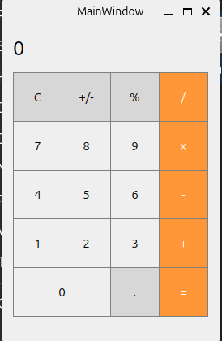

Voici une version simplifiée du `README.md` avec uniquement l'image et une description sans le code :

---

# Calculator-QT-Creator-C++



## Description

Ce projet est une calculatrice graphique simple, créée avec C++ et Qt. L'interface est conçue pour permettre des opérations de base telles que l'addition, la soustraction, la multiplication, la division, ainsi que des opérations unaires et l'utilisation de pourcentages.

## Fonctionnalités

- **Affichage numérique** pour montrer les résultats et les entrées.
- **Boutons de chiffres** pour entrer les nombres de 0 à 9.
- **Opérations binaires** : addition (+), soustraction (-), multiplication (x), division (/).
- **Opérations unaires** : changement de signe (+/-) et pourcentage (%).
- **Fonction de décimale** pour ajouter un point décimal.
- **Bouton de suppression (C)** pour réinitialiser l'affichage.
- **Évaluation des expressions** via une fonction dédiée.

## Instructions d'Installation

1. Clone le dépôt Git :
   ```bash
   git clone https://github.com/Angelo-Ramarovahoaka/Calculator-QT-Creator-C-.git
   ```
2. Ouvre le projet avec Qt Creator.
3. Compile et exécute le projet.

## Utilisation

Utilise les boutons de la calculatrice pour effectuer des opérations simples. Appuie sur le bouton `=` pour afficher le résultat de l'expression en cours.
